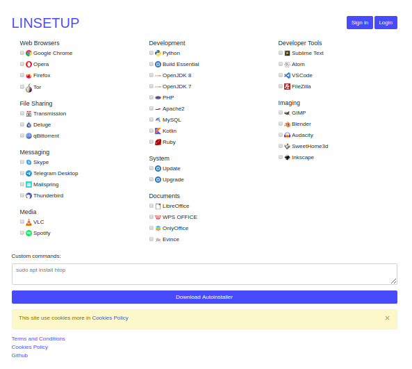

# Linsetup
Linsetup allows you to select packages from a database and create a script that will be installed when you run it.

## How to use linsetup?
To use linsetup you can enter the web <a href="https://linsetup.com"> here </a> or mount it yourself by installing LAMP and importing the database.

